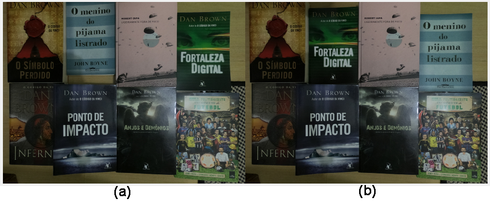

# SIFTObjectDist

Finding distance between objects in images using SIFT

## Code Structure

	main.m               - the entry point of the program
	sift.m               - script that involkes SIFT program based on various OS
	SIFTmatch.m          - match SIFT descriptors according to the distance in Euclidean space
	showkeys.m           - display SIFT descriptors
	getPosition.m        - find the estimated position (x,y) for an object on a scene
	objectScenesDistance - find the distance between the same object in two scenes
	objectsDistance	     - find the distance between two objects in the same image
	
## Sample Experiment Results

#### Distance between two objects in the same image

  

<pre><code>dist = objectsDistance('images/book1.jpg', 'images/book2.jpg', 'images/scene1.jpg');</pre></code>

:straight_ruler: Result: approximately 592px.

#### Distance between the same object in different scenes

<pre><code>dist = objectScenesDistance('images/book1.jpg','images/scene1.jpg','images/scene2.jpg');</pre></code>

:straight_ruler: Result: approximately 471px.

## Usage
Clone the repository using the following command

<pre><code>git clone https://github.com/cristiansimioni/SIFTObjectDist.git</pre></code>

:warning:  *Note:* This program doesn't work on MacOS. Please choose Windows, Linux or other Unix-like OS

:exclamation: *License:* This software is being made available for research purposes only. It is necessary to obtain a license from the University of British Columbia for commercial applications. See the file LICENSE in this repository for conditions of use. You can find more information [here](http://www.cs.ubc.ca/~lowe/keypoints/).

## Paper 

:page_with_curl: If you're interested on this application, you can read the full paper [here](paper/paper.pdf) (in Brazilian Portuguese :brazil:)
